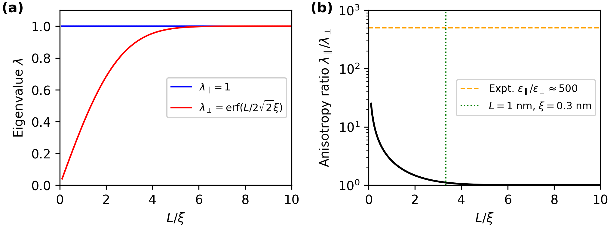

# NanoFluids-AI: NanoFluids-AI-Kernel-Verification (WP1)

[](https://opensource.org/licenses/MIT)
[](https://www.python.org/downloads/)

Analytical verification of non-local Gaussian kernel behavior under nanoconfinement for the **NanoFluids-AI** project (WP1: Mathematical Foundations).

## Overview

This repository contains a complete analytical and numerical verification of how geometric confinement induces effective anisotropy in isotropic molecular response kernels. The toy model demonstrates that even for an isotropic Gaussian kernel, domain truncation breaks symmetry and generates directionally-dependent effective properties.

This work establishes theoretical foundations for understanding how geometric confinement modifies effective material properties through non-local kernel convolutions. It serves as a baseline for more sophisticated data-driven kernel discovery approaches in WP3.



### Key Result

For an isotropic Gaussian kernel `K_ξ(r) = (2πξ²)^(-3/2) exp(-|r|²/(2ξ²))` confined to a slit domain `Ω_L = {(x,y,z) : z ∈ [-L/2, L/2]}`:

```
λ_∥ = 1                        (unbounded in-plane integration)
λ_⊥ = erf(L / (2√2 ξ))         (truncated out-of-plane integration)
```

where:
- `L` is the confinement length [nm]
- `ξ` is the molecular correlation length [nm]
- `erf` is the error function

### Physical Interpretation

The anisotropy ratio `λ_∥/λ_⊥ = [erf(L/(2√2ξ))]⁻¹` quantifies emergent dielectric anisotropy arising purely from geometric confinement. For water under 1 nm confinement:

- **Gaussian kernel prediction**: λ_∥/λ_⊥ ≈ 1.2
- **Experimental observation** (Wang et al. *Nature* 2025): ε_∥/ε_⊥ ≈ 500
- **Discrepancy**: ~400× factor

This gap motivates data-driven kernel discovery in WP3 of the NanoFluids-AI project.

## Installation

### Prerequisites

- Python 3.8 or higher
- pip package manager

### Clone the repository

```bash
git clone https://github.com/renee29/NanoFluids-AI-Kernel-Verification.git
cd NanoFluids-AI-Kernel-Verification
```

### Install dependencies

```bash
pip install -r requirements.txt
```

## Usage

Run the complete verification pipeline:

```bash
python WP1_preliminar_model_verification.py
```

### Output

The script performs four verification steps:

1. **Symbolic Verification**: Derives λ_⊥ analytically using SymPy and verifies asymptotic limits
2. **Numerical Validation**: Cross-validates analytical formula against numerical quadrature (error < 10⁻¹⁰)
3. **Anisotropy Analysis**: Computes anisotropy ratios and compares with experimental data
4. **Publication Figure**: Generates `WP1_preliminar_model_verification.png` with two panels:
   - (a) Eigenvalue evolution λ_∥ and λ_⊥ vs L/ξ
   - (b) Anisotropy ratio in log scale with experimental comparison

## Project Structure

```
NanoFluids-AI-Kernel-Verification/
├── WP1_preliminar_model_verification.py    # Main verification script
├── README.md                         # This file
├── LICENSE                           # MIT License
├── requirements.txt                  # Python dependencies
├── CITATION.cff                      # Citation metadata
└── .gitignore                        # Git ignore rules
```

## Citation

If you use this code in your research, please cite:

```bibtex
@software{nanofluids_ai_wp1_2025,
  author       = {NanoFluids-AI Team},
  title        = {NanoFluids-AI: WP1 Toy Model Verification},
  year         = {2025},
  publisher    = {Zenodo},
  version      = {v1.0.0},
  doi          = {10.5281/zenodo.XXXXXX},
  url          = {https://github.com/renee29/NanoFluids-AI-Kernel-Verification}
}
```

## License

This project is licensed under the MIT License - see the [LICENSE](LICENSE) file for details.

## Contact

For questions or collaboration inquiries, please open an issue on GitHub or contact the NanoFluids-AI team.

---

**Project Status**: Initial release (v1.0.0) - December 2025
